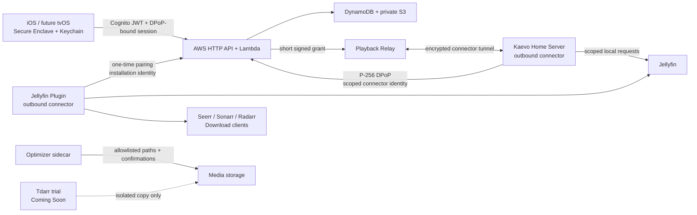

# Kaevo Threat Model

## Security objective

Kaevo must let an authorized household discover and play its media remotely without exposing provider credentials, filesystem paths, home-network services, parental policies, or destructive media controls to another household, an untrusted profile, or the public internet.

## System and trust boundaries

Primary boundaries:

1. **Device to Cloud:** public internet; tokens can be stolen, replayed, or automated.
2. **Cloud tenant boundary:** every profile, connector, device, object, and request identifier must remain pinned to one tenant.
3. **Cloud to home:** Cloud is not inherently trusted to execute arbitrary LAN calls. Typed commands, exact route constraints, capabilities, idempotency, expiry, and connector binding are mandatory.
4. **Plugin/Home to providers:** provider credentials and LAN reachability are high-value capabilities. URLs and responses are untrusted.
5. **Optimizer to media filesystem:** the only boundary where a software error can permanently destroy user media. Copy/backup/verification and explicit approval are mandatory.
6. **Adult to child profile:** UI authentication is insufficient for cloud policy writes unless the server can distinguish an owner/recent-auth session.

## Assets

| Asset | Impact if compromised |
|---|---|
| Jellyfin/provider API keys | Full library visibility; provider mutation; possible download/deletion actions. |
| App and connector session tokens | Remote metadata, playback, or command access as a household. |
| Playback grants and relay tickets | Temporary access to a precise playback stream; privacy exposure if logged. |
| Profile identity/history | Sensitive household viewing behavior and personalization data. |
| Parental-control policy | Child-safety bypass and inappropriate content exposure. |
| Media files and Jellyfin metadata | Irreversible household data loss or corruption. |
| Cloud tables and avatar/payload buckets | Cross-tenant privacy breach, denial of service, or account takeover support. |
| Release/update channel | Supply-chain compromise of every installed server/plugin. |

## Threat actors

- Internet attacker with no Kaevo account.
- Malicious or compromised Kaevo household/profile.
- Child profile attempting to bypass policy.
- Local LAN guest or compromised IoT device.
- Attacker with a stolen iPhone backup, jailbroken phone, crash log, URL history, or bearer token.
- Compromised Cloud, GitHub release, Jellyfin plugin, provider, or dependency.
- Accidental owner/operator error during optimizer, Docker, TrueNAS, or update work.

## Abuse cases and controls

| Abuse case | Existing controls | Residual risk / required control |
|---|---|---|
| Guess/replay a pairing code | Hash at rest, ten-minute TTL, atomic consume after patch. | Add per-IP/device attempt limits and owner-visible pairing history. |
| Rebind a connector/device to another profile | Tenant pinning and conditional rejection after patch. | Add audit alerts for repeated mismatch attempts. |
| Steal an app bearer | This-device Keychain, P-256 installation key, 15-minute access token, DPoP, refresh-family rotation/reuse revocation. | Add device attestation/risk scoring and prove revocation/recovery after staged deployment. |
| Ask Cloud to delete/mutate home data | Typed allowlist, capabilities, plugin elevation, exact identifiers, confirmation gates; profile mutation removed. | Owner-scoped command authorization and human-readable approval receipt. |
| Replay a completed remote request | Idempotency plus conditional terminal transition after patch. | Retain immutable security audit events beyond request TTL. |
| Bypass parental controls | Local Face/Touch ID and Kaevo PIN plus server-recognized owner role, recent-auth, authoritative profile membership, and protected keys. | Prove owner approval/recovery UX on physical devices. |
| SSRF into router/metadata/admin services | Provider type/path allowlists and elevated provisioning. | Explicit scheme/port policy, block link-local/metadata/multicast/unspecified targets, revalidate resolved IP on every connection. |
| Leak grant through logs | Grant is short-lived, item/device/mode scoped. | Redact path/query at every edge and avoid access logging signed path components. |
| Exhaust Cloud cost/relay capacity | API Gateway baseline throttles, Lambda/container bounds, size limits/timeouts. | Per-identity quotas, WAF/abuse alarms, concurrency/budget alarms, remote image limits. |
| Destroy media during optimization | Allowed roots, no broad roots, no symlink escape, backup/output checks, verification, exact confirmation, cleanup tests. | Keep default analyze-only; one-title canary; immutable/offline backup; never enable Tdarr source deletion initially. |
| Supply a malicious plugin update | GitHub/catalog checksums and controlled publishing. | Sign release metadata/artifacts and verify signature against a pinned publisher key. |

## Security invariants

1. A request identifier never changes tenant after creation.
2. A one-time token can transition only once, atomically.
3. A terminal request cannot be rewritten.
4. A profile session cannot authorize owner/admin/destructive operations.
5. A child/profile session cannot weaken protected family policy.
6. No credential default makes a production service usable.
7. Release binaries contain no development credential loading path.
8. Cloud can request only operations the home connector explicitly implements and the installed plugin advertises.
9. Playback grants are short-lived and bound to connector, profile, device, media source, item, mode, and bitrate.
10. Optimizer/Tdarr work never replaces or deletes original media before verified output and explicit owner approval.
11. A copied access token without the installation private key is unusable.
12. Refresh-token reuse revokes the entire session family.
13. Provider configuration, parental weakening, connector/device ownership, optimizer execution, and destructive actions require authoritative owner capability; ordinary profile sessions are never sufficient.
14. Cognito custom attributes, client metadata, request bodies, and ID tokens are never household authority; Kaevo claims are issued only into access tokens after the complete DynamoDB identity graph agrees.
15. A missing principal is never promoted during token generation. Initial owner authority is created only by the throttled, enrollment-client-only, server-generated atomic bootstrap.
16. Signed-token lifetime does not delay application revocation: every protected human request compares current principal state, relationships, role, and `authz_version` before capabilities are evaluated.

## Residual architectural decision

The local candidate now separates consumer relay transport from production household identity, but the deployed system has not migrated. Before public use, approve and operationally prove one of these trust contracts:

- **Public Kaevo service:** real owner accounts, household membership and roles, child sessions, device-bound tokens, scoped authorization, audit/recovery/abuse systems.
- **Private-network product:** Tailscale or an equivalent user-owned overlay carries home traffic, while Kaevo Cloud handles only minimal account/sync metadata.
- **Hybrid (recommended):** public Kaevo relay remains the simple default; security-conscious homes can select Private Direct through Tailscale. Both modes retain application-level authorization.
