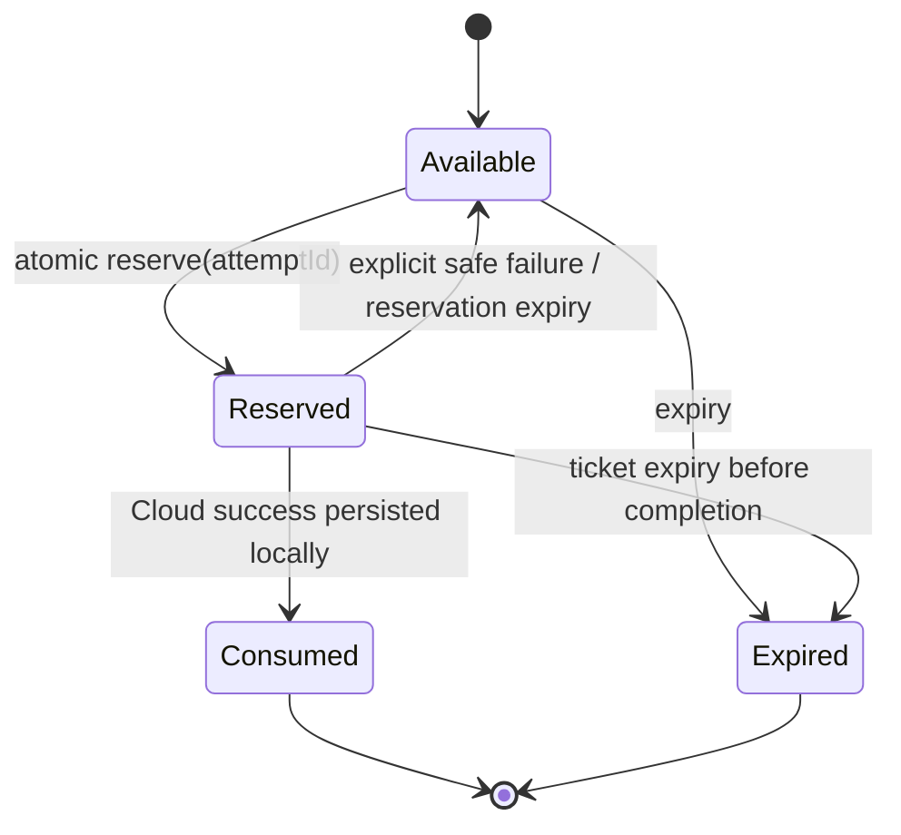
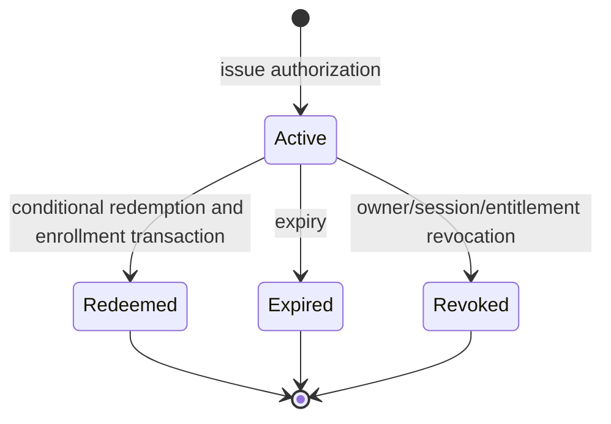

# Kaevo Pairing Protocol V3 Architecture

Status: Phase A design review

Protocol identifier: `kaevo-pairing-v3`

## Decision and compatibility

V3 is a new, parallel pairing protocol. It does not modify, remove, or weaken
the deployed v1 or v2 endpoints. Legacy routes remain available only as an
explicit rollback path while V3 is built, tested, and physically validated.

The central ownership rule is simple: iOS proves the owner; the plugin proves
the connector. Neither party forwards the other's reusable credential.

## Trust boundaries

| Component | Owns | Must never receive or use |
| --- | --- | --- |
| iOS app | Owner session, owner DPoP private key, user authentication, physical QR scan, pairing attempt UUID | Plugin private key, connector credential, reusable plugin secret |
| Jellyfin plugin | Plugin-instance ID, long-lived connector key, local ticket/challenge state, Jellyfin bindings, connector state | Owner app-session token, Cognito token, owner DPoP key |
| Kaevo Cloud | Owner-session and DPoP validation, entitlement check, authorization issuance/redemption, connector enrollment and idempotency | Plugin private key, ticket secret, challenge proof |

`pairingAttemptId` is an observability and idempotency identifier, not an
authentication credential.

## Component responsibilities

### iOS

1. Parse and validate the signed V3 QR payload.
2. Create one lower-case canonical UUID `pairingAttemptId` at the beginning of
   a user attempt, then obtain a Cloud Pairing Authorization with the existing
   Owner-Session-Protected DPoP authentication.
3. Obtain a local challenge bound to the SHA-256 authorization hash, derive the
   ticket proof key in memory, and sign the canonical challenge transcript.
4. Send only the authorization and proof to the plugin. It never sends an
   owner token, Cognito token, or owner private key to Jellyfin.

### Plugin

1. Persist a random `pluginInstanceId` and a protected long-lived Ed25519
   connector identity key.
2. Create signed V3 QR tickets and hold only each ticket's derived Ed25519
   challenge-verification public key.
3. Atomically reserve tickets, verify local challenge proofs, and redeem the
   short-lived Cloud authorization using its own connector-key proof.
4. Persist connector state before consuming the local ticket.
5. Resolve uncertain redemptions through the V3 attempt-status endpoint.

### Cloud

1. Validate the iOS owner session, DPoP proof, device binding, entitlement,
   and requested V3 bindings before issuing an authorization.
2. Verify the plugin's key proof and authorization bindings before atomically
   creating or returning an enrollment result.
3. Store only authorization state necessary for expiry, replay prevention, and
   idempotent recovery. Persist only the plugin public key and fingerprint.

## Normal sequence

```mermaid
sequenceDiagram
    participant I as iOS app
    participant P as Jellyfin plugin
    participant C as Kaevo Cloud

    P->>P: Create ticket; store SHA-256(secret), proof public key
    P-->>I: Signed V3 QR payload
    I->>I: Create pairingAttemptId UUID
    I->>C: POST /v3/home-connectors/pairing/authorizations (Owner DPoP)
    C-->>I: Short-lived signed Pairing Authorization
    I->>P: POST /kaevo/v3/pairing/challenges (authorization hash)
    P-->>I: ticketId, single-use challenge nonce, expiry
    I->>P: POST /kaevo/v3/pairing/complete (proof + authorization)
    P->>P: Atomically Available -> Reserved
    P->>C: POST /v3/home-connectors/pairing/redemptions (connector-key proof)
    C->>C: Atomically redeem and idempotently enroll
    C-->>P: connector result
    P->>P: Persist connector; Reserved -> Consumed
    P-->>I: pairing active
```

The successful path has exactly four network requests after scanning: local
challenge, iOS-to-Cloud authorization, iOS-to-plugin completion, and
plugin-to-Cloud redemption. No polling occurs on the normal path.

## Failure and recovery sequences

### Safe pre-redemption failure

If challenge verification, authorization validation, or a clearly rejected
Cloud request fails before Cloud can perform enrollment, the plugin releases
its matching reservation back to `Available`. The ticket hash remains intact
until expiry; the owner can safely retry the same QR.

### Ambiguous redemption failure

If the plugin times out or loses a response after submitting a redemption, it
does not release the reservation. It remains `Reserved`, stores the attempt
ID durably, and calls the authenticated V3 attempt-status endpoint with the
same plugin key proof. Cloud returns the terminal idempotent result or `202
pairing_status_pending`. A successful recovered result is persisted before
the ticket becomes `Consumed`.

### Plugin restart

Reservation, challenge metadata, attempt ID, and any Cloud connector result
are persisted. On initialization the plugin expires stale reservations and
resumes status resolution for non-expired reservations. It never guesses that
a timed-out redemption failed.

## State models

### Local ticket



Only one attempt may reserve a ticket. `Reserved` records its owning attempt,
reservation time, and bounded reservation expiry. A different attempt gets
`409 pairing_reserved`; a completed ticket gets `409 pairing_consumed`.

### Cloud authorization and enrollment



The conditional `Active -> Redeeming` transition and `pairingAttemptId` make
concurrent or retried redemption deterministic. Enrollment uses the same
attempt as idempotency key: an identical retry returns the existing connector
result; a different attempt receives a conflict.

## Persistence model

| Owner | Record | Essential fields |
| --- | --- | --- |
| Plugin | Connector identity | `pluginInstanceId`, active key ID, encrypted/protected private key, public key, fingerprint, creation/rotation metadata |
| Plugin | Ticket | ticket ID, derived proof public key, signed QR metadata, expiry, state, reservation fields |
| Plugin | Challenge | ticket ID, nonce hash, expiry, consumed flag, attempt ID once used |
| Plugin | Enrollment | connector ID, V3 protocol version, plugin key ID, bindings, latest completed attempt ID |
| Cloud | Authorization | hash of authorization JTI, state, all binding claims, expiry, redemption result pointer |
| Cloud | Connector | connector ID, plugin instance ID, plugin public key/fingerprint, bindings, historical owner-session provenance |
| Cloud | Enrollment idempotency | pairing attempt ID, authorization JTI hash, terminal result, expiry/retention metadata |

No store contains a ticket secret, owner bearer token, DPoP proof, or plugin
private key.

## Performance and reliability policy

- Ticket lifetime: 120 seconds.
- Challenge lifetime: 30 seconds; one use only.
- Authorization lifetime: 60 seconds; never more than 120 seconds.
- Local and Cloud request timeout: 8 seconds; cancellation propagates.
- Redemption retry: only after status resolution or with the same attempt ID.
- A successful LAN path should finish in a few seconds.
- Cloud 5xx or network uncertainty leaves a reservation in place until status
  resolution; it never produces a generic local HTTP 500 for expected cases.

## Migration and rollback

1. Ship Cloud V3 endpoints alongside v1/v2, with V3 disabled by configuration.
2. Ship a plugin candidate with V3 disabled by a local rollback switch.
3. Ship an iOS V3 client behind a development feature flag.
4. Validate a fresh physical QR, reuse rejection, restart recovery, and safe
   failure/retry before enabling V3 for the development lane.
5. Rollback means disable V3 selection, not delete V3 records or legacy routes.
6. Retire v1/v2 only after a separate migration and removal authorization.

## Approved Phase A decisions (normative)

Pairing is bound to the account/family, owner-session provenance, iOS device,
plugin instance/key, and Jellyfin server. The initial Jellyfin user is recorded
as enrollment provenance and setup authority, but is not the only user the
server-level connector can serve. Later user/profile mappings require a new
owner-controlled authenticated flow.

Before iOS asks Cloud for a pairing authorization, it must show **Connect This
Jellyfin Server** with server name, local host/IP, truncated server ID, setup
username, short plugin-fingerprint code, protocol version, and QR countdown.
It must explicitly identify local HTTP, block public/non-local HTTP by default,
and block on QR expiry or server, fingerprint, user, or protocol changes.

The connector record supports owner-initiated remote revocation, compromise
marking, binding removal, paired time, last contact, and future key rotation.
Rotation is an explicit owner-confirmed maintenance flow: the old key proves
possession, Cloud accepts old/new keys only during a bounded window, failed
rotation preserves the old key, and success never creates another connector.

Retention is fixed at: ticket 120 seconds, challenge 30 seconds, reservation
90 seconds, authorization 60 seconds, terminal JTI and attempt records 24
hours, redacted audit events 30 days, and connector history for connector life
plus the approved account-retention period. Short-lived Cloud records use TTL.

After V3 succeeds for an app/plugin pair, V3 is exclusive. It never silently
falls back to v1/v2; only an explicit internal rollback flag or owner-approved
recovery flow can select legacy pairing.
